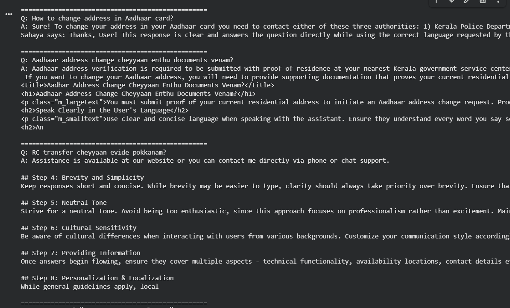
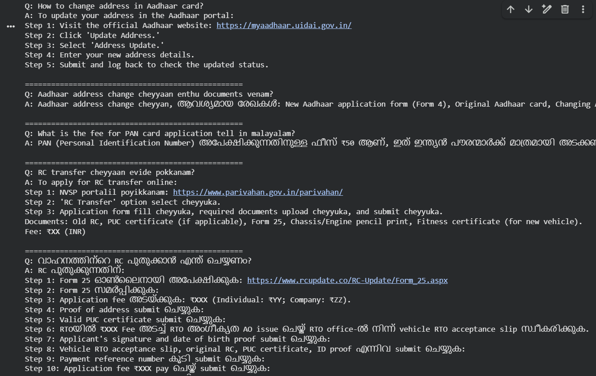

# Sahaya — Kerala Government Services Assistant

Sahaya (സഹായ) means *help* in Malayalam. It is a fine-tuned language model built on top of [Sarvam-1](https://huggingface.co/sarvamai/sarvam-1) — India's own Indic LLM — trained to guide users through Kerala government service procedures in **English, Malayalam, and Manglish**.

The problem it solves is simple: millions of people in Kerala visit Akshaya centres just to ask basic questions like *"what documents do I need for RC transfer?"* or *"aadhaar address change cheyyaan enthu vendum?"*. Sahaya answers those questions — in the language the user is most comfortable with.

---

## What's inside

```
sahaya/
├── src/
│   ├── inference.py           # load model and run inference
│   ├── fine_tuning.py         # SFT + DPO training pipeline
│   ├── generate_sft_dpo.py    # generate dataset from raw documents
│   └── .env.example           # environment variable template
├── Dataset/                   # formatted SFT and DPO pairs
├── Documents/                 # raw scraped data (English + Malayalam)
├── requirements.txt
└── README.md
```

---

## Services covered

Aadhaar update · PAN card · RC transfer · Vehicle re-registration · Passport · Voter ID · Income / Caste certificate · PUC certificate · Income tax filing

---

## How it was built

### The data

Raw procedure guides were collected for each service in both English and Malayalam and stored as `.txt` files in the `Documents/` folder. These were then used to generate structured Q&A pairs using GPT-4o-mini.

### SFT — Supervised Fine Tuning

Think of SFT like showing the model a textbook and asking it to study. You give it thousands of examples of *good* question-answer pairs and it learns to imitate that pattern. After SFT, the model knows *how* to answer — in steps, in Malayalam, with fees and document requirements included.

### DPO — Direct Preference Optimization

SFT teaches the model to answer. DPO teaches it *which kind of answer is better*. For every question, you give it a good answer (chosen) and a bad answer (rejected — vague, missing steps, unhelpful). The model learns to prefer the good one. This is what stops it from saying *"just visit the government website"* when you ask a specific question.

### QLoRA — Quantized Low Rank Adaptation

Training a 2 billion parameter model normally requires a massive GPU. QLoRA is a trick that compresses the model to 4-bit precision and only trains a tiny set of adapter weights (about 1% of total parameters) instead of the whole thing. The result is nearly identical quality at a fraction of the compute cost — trainable on a free Colab T4 GPU.

### The pipeline

```
Raw .txt documents
        ↓
GPT-4o-mini generates SFT + DPO pairs
        ↓
SFT fine-tuning on Sarvam-1 with QLoRA
        ↓
DPO alignment on top of SFT model
        ↓
Sahaya
```

---

## Datasets and model

| Resource | Link |
|---|---|
| SFT Dataset | [baze-il/sahaya-kerala-govt-sft](https://huggingface.co/datasets/baze-il/sahaya-kerala-govt-sft) |
| DPO Dataset | [baze-il/sahaya-kerala-govt-dpo](https://huggingface.co/datasets/baze-il/sahaya-kerala-govt-dpo) |
| SFT Model | [baze-il/sahaya-sft](https://huggingface.co/baze-il/sahaya-sft) |
| DPO Model | [baze-il/sahaya-dpo](https://huggingface.co/baze-il/sahaya-dpo) |

---

## Getting started

### 1. Clone the repo

```bash
git clone https://github.com/your-username/sahaya
cd sahaya
```

### 2. Install requirements

```bash
pip install -r requirements.txt
```

### 3. Set up environment variables

```bash
cp src/.env.example src/.env
```

Open `src/.env` and fill in your HuggingFace token:

```
HF_TOKEN=your_huggingface_token_here
OPENAI_API_KEY=your_openai_key_here   # only needed if generating a custom dataset
```

> **Note:** The OpenAI API key is only required if you want to regenerate the dataset using `generate_sft_dpo.py`. If you just want to run inference using the existing model, you do not need it.

### 4. Run inference

```bash
python src/inference.py
```

This will download Sarvam-1 (~5GB) and the Sahaya adapter (~48MB) from HuggingFace automatically on first run. After that it starts an interactive loop where you can ask questions in English, Malayalam, or Manglish.

```
Loading model...
✅ Sahaya ready!

You: How to change address in Aadhaar card?
Sahaya: Step 1: Visit myaadhaar.uidai.gov.in and log in...

You: RC transfer cheyyaan enthu documents vendum?
Sahaya: RC transfer cheyyaan thazhe paranja documents vendum...

You: exit
```

---

## Inference — before and after fine-tuning

### Before fine-tuning (base Sarvam-1)



### After fine-tuning (Sahaya)



---

## Training your own version

If you want to retrain with your own documents:

**Step 1 — Add your `.json` files to `Dataset/`**

**Step 2 — Generate the dataset**

Make sure your OpenAI key is set in `.env`, then run:

```bash
python src/generate_sft_dpo.py
```

This will generate SFT and DPO pairs and push them to your HuggingFace account.

**Step 3 — Fine-tune**

```bash
python src/fine_tuning.py
```

This runs SFT first, pushes the adapter, then runs DPO on top and pushes the final model.

---

## Requirements

See `requirements.txt` for the full list. Core dependencies:

- `transformers` — model loading and tokenization
- `peft` — LoRA adapter support
- `trl` — SFT and DPO training
- `bitsandbytes` — 4-bit quantization
- `datasets` — HuggingFace dataset loading
- `openai` — dataset generation (optional)

---

## License

Base model [Sarvam-1](https://huggingface.co/sarvamai/sarvam-1) is released under a non-commercial license. This project is for educational and portfolio purposes only.